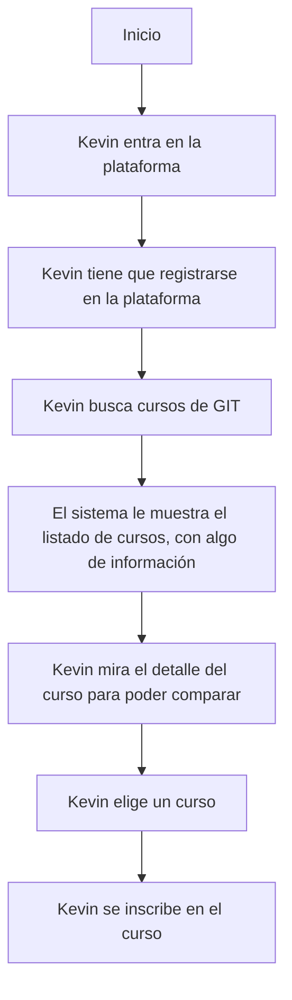

# Paso 1: Casos de Uso (Necesidades): También hay un estándar: Unified Modeling Language
# Paso 2: User PERSONAS
- Entender a mis usuarios
- Empatizar con mis usuarios
- Diseñar procesos que optimicen la experiencia de mis usuarios
- De cada USER PERSONA:
  - Nombre y Apellidos
  - Foto
  - Datos demográficos
  - Objetivo
  - Motivaciones
  - Puntos de dolor/Frustraciones
  - Habilidades / Skills
# Paso 3: User STORYBOARD
- Cómo interactúan mis user PERSONA con mi producto/servicio
- El objetivo es poner de manifiesto las fricciones/puntos de dolor en la interacción de los usuarios con el producto/servicio
- Lo que represento es:
  - Para un USER PERSONA
  - Para un caso de uso
  - Interacciones
  - Acciones del usuarios
  - Puntos de dolor (Fricciones al usar el producto/servicio)
  - Soluciones
# Paso 4: Diagramas de ACTIVIDAD: Existe un estándar: UML
Representar TODA LA SECUENCIA DETALLADA de tareas y posibilidades que ocurren cuando un usuario interactúa con el producto/servicio.
Esto nos ayuda a:
- Comunicarnos con el equipo de desarrollo
- Identificar problemas (Puntos donde puede haber una pobre experiencia de usuario) > Optimizar UX

...

# Paso n: CODIGO
---
Cada diagrama (y usamos muchos al modelar un sistema y al trabajar en UX) lo hago con una finalidad:
- Quiero contar ALGO a ALGUIEN (Y el ALGO está relacionado con el ALGUIEN)
- En las primeras etapas tengo poca información (Puedo representar poca información)

---

# USABILIDAD

Es una medida de la facilidad con la que un sistema/producto/servicio puede ser utilizado por usuarios específicos para alcanzar sus objetivos de manera:
- EFECTIVA: 
    Capacidad del usuario de lograr sus objetivos al usar el sistema/producto/servicio
- EFICIENTE:
    Relacionado a la cantidad de esfuerzo y tiempo invertido por el usuario en alcanzar sus objetivos
- SATISFACTORIA: 
    Relacionado con la percepción del usuario al utilizar el sistema/producto/servicio

    Este punto se sola en parte (o no tan parte) con el concepto de UX.

La usabilidad es uno de los 7 aspectos de la UX... pero hay cosas que impactan también en la percepción del usuario y que no son USABILIDAD, por ejemplo: ESTETICA (UI)!

Uno de los mayores expertos en usabilidad: Jakob Nielsen

---

# Los 10 principios de Jakob Nielsen para la usabilidad

1. Visibilidad del estado del sistema
En todo momento el sistema debe informar al usuario de qué está ocurriendo.
- Barra de progreso
- Spinner
- Estrellitas volando
- Un botón desactivado
- Un overlay
- Breadcrumb (migas de pan)
- Formulario de compra/registro... PASO 1 de 3: Datos de Facturación

No puede ser que le de a enviar un formulario... y la pantalla se quede igual... ¿Se ha enviado? ¿No se ha enviado? ¿Qué ha pasado? Le doy otra vez?

2. Coincidencia entre el sistema y el mundo real

El sistema tiene que hablar el mismo idioma que el usuario.
Si uso imágenes: IMAGENES CLARAS Y ACEPTADAS Y RECONOCIBLES 
    ICONO TRES RAYITAS HORIZONTALES: MENU
                ^^^^^
        Todo el mundo conoce esto? GERTRUDIS (65 añitos) NO... quizás no es mi usuario... y está bien.
            Wallapop > Vinted

3. Control y libertad del usuario

Voy a intentar guiarle para que la cague lo menos posible.
El usuario se va equivocar al trabajar. ES HUMANO! Ayúdale en estos casos:
    - DESHACER
    - QUITAR DEL CARRITO DE LA COMPRA
    - Revisar datos importantes (TRANSCENDENTES) de un formulario antes de enviarlo
        DATOS DEL PEDIDO
        DATOS DE FACTURACIÓN - Paso 1 de 7 me equivoque en el teléfono.
            Más vale que me dejes revisarlo (Al menos releerlo) antes de enviarlo.
            Si no.. déjame editarlo... el teléfono. No me hagas empezar de CERO.

4. Consistencia y estándares

Hay cosas que los humanos las entendemos de una forma... NO LAS CAMBIES TU PORQUE SI

VERDE = GUAY ! Europa (semáforos)
ROJO = RUINA !

ICONOS

MENU DE NAVEGACION: ARRIBA / IZQUIERDA

5. Prevención de errores

Prevenir es mejor que curar. AYUDAS AL USUARIO = GUAY !

    Autocompletar.
    Desactivar un botón de envío de un formulario si los datos no están guays.

6. Reconocer antes que recordar

No quiero al usuario APRENDIENDO A USAR EL SISTEMA.
No tiene que memorizar cosas... para podar usar el sistema.

Tiene que se natural e intuitivo.

7. Flexibilidad y eficiencia de uso

Flexibilidad: Cualquier usuario puede usar el sistema de forma eficiente.

- Accesibilidad
- Opciones simples / Opciones avanzadas
- BUSCADOR DE GOOGLE
  - Usuario novel o que quiere hacer algo sencillo: Pone la palabra / frase y punto
  - Usuario avanzado: Puede usar comandos avanzados

8. Diseño estético y minimalista

- Está bien crear un diseño estético agradable. Sin recargar. El diseño complementa la ESTRUCTURA DE LA INFORMACIÓN
- Mostrar en cada momento lo que tengo que mostrar (lo que es útil)

9. Ayudar a los usuarios a reconocer, diagnosticar y recuperarse de los errores.

    404 - Página no encontrada
    403 - Acceso denegado
    401 - No autorizado

    En un formulario no me pongas:
     El campo "nombre" no cumple con el patrón:
     \^[a-zA-Z0-9.]{0,10}$

10. Ayuda y Documentación

La idea es que el usuario no necesite conocer mucho del sistema para utilizarlo.

? - Ayuda contextual
Minitour
FAQ

Ayudas más potentes (contextualizadas)

---

# Arquitectura de la información

Es la disciplina que se encarga de organizar la información de un sistema de forma que sea fácil de encontrar, entender y navegar.

Cómo agrupar los datos (JERARQUIAS DE INFORMACION)
    VVV
Cómo la vamos a representar por pantalla (UI)

## OBJETIVOS:

- Ayudar a los usuarios a encontrar lo que necesitan de forma rápida y sencilla
- Reducir la carga cognitiva al organizarse de forma lógica (que tenga que pensar lo menos posible)
- Evitar que el usuario tenga que ir por múltiples sitios (pantallas, páginas, secciones) para encontrar lo que necesita

## JERARQUIAS DE INFORMACION

Organizar la información por niveles: ABSTRACCION -> CONCRETO
                                      GENERAL     -> ESPECIFICO

A tener en cuenta:

- Las categorías debe ser claramente identificables/comprendidas por el usuario y ser representativas de la información que contienen.
- No tener muchos niveles de jerarquía (jerarquías muy profundas).
- En paralelo tampoco debo tener niveles de jerarquía muy amplios (muchas categorías en un mismo nivel).
- Hay que buscar un equilibrio. 4-5 categorías x nivel es un buen punto de partida.

Esta una forma de estructurar la información. A las formas de estructurar la información las denominamos TAXONOMIAS.

Y no siempre, nos interesa una taxonomía jerárquica. Incluso en ocasiones querremos tener varias taxonomías paralelas que aplicar sore los datos.

A veces tendremos varias taxonomías que si serán jerárquicas y paralelas entre si.

## Agrupaciones de información para trabajar con ellas en los distintos casos de uso.

- Por similitud: Informes que tienen características similares
- Por tipo función
- Agrupar visualmente
---

# Pruebas software

Hay muchas formas paralelas de clasificarlas

## En base al conocimiento que tenga del objeto de prueba

- Pruebas de caja blanca
- Pruebas de caja negra

## En base al objeto de prueba

- Pruebas funcionales
- Pruebas no funcionales:
  - Pruebas de rendimiento
  - Pruebas de seguridad
  - Pruebas de carga
  - Pruebas de estrés
  - Pruebas de UX

## En base al nivel de la prueba

- Pruebas unitarias
- Pruebas de integración
- Pruebas de sistema(end-to-end)
- Pruebas de aceptación

## En base al procedimiento de ejecución

- Pruebas estáticas
- Pruebas dinámicas

## En base a la automatización

- Automatizadas
- Manuales

---

- Presenciales        Tengo un profesor y un horario.. Y el pprofesor y alumnos comparten un espacio físico
-> Remotas            Tengo un profesor y un horario fijo. El profesor y los alumnos no comparten un espacio físico
- Online              No tengo un profesor y un horario fijo. Los alumnos acceden a contenidos... y habrá un tutor para resolver dudas de forma asíncrona.

## Aplicación: LMS: Learning Management System

Quiero una app donde poder ofrecer cursos en remoto.

---
NECESIDADES
CASOS DE USO -> ACTORES
ACTORES -> USER PERSONAS
    USER PERSONAS: NO...
    - Alumnos
    - Profesores
    - Si me contrata el curso INDRA (RRHH) tendré alguien de RRHH (Paula) que querrá entrar al sistema.

Habrá una información disponible. LA INFORMACION ES INFORMACION.
Cursos:
    - Titulo
    - Descripcion
    - Complejidad
    - Duración
    - Temario
    - Objetivos
    - Precio
    - Enlaces a material adicional
    - Tipo de curso**
    - Estado del curso
    Imparticiones de ese curso:
        - Profesor
        - Valoraiones
        - Horario
        - Enlaces de videoconferencia
        - Estadísticas de los alumnos
        INSCRIPCIONES:
            - % de completado a ver como lo llevo.
            - Curso
            - Diploma
            - Nombre
            - Apellidos
            - Email
            - Teléfono

ESTUDIANTES
    Cursos

Esa información habrá que estructurarla de alguna forma.

---

Lo primero ir identificando los datos que tengo (la información) y cómo se relacionan entre sí.
Y será un proceso de poco a poco.

    MODELANDO

Esa información la iré agrupando por casos de uso / Actores
        +++++
(Wireframes) - Esqueleto de la UI
    vvvv  Detalle más fino posible de implementación
Una vez completado eso:
Representar esa información por pantalla en mi sistema : UI

---

A Paula (RRHH) 
y a Kevin (Alumno) les voy a sacar el mismo menú? NI SIQUIERA!

Les puedo sacar el mismo.... Con opciones desactivadas... o que cuando pulsen ahí les diga:
- No tienes datos
- No tienes permisos

---

KEVIN: Inscribirse en un curso. Storyboard -> Puntos de dolor

- Viñeta 1: Kevin entra en la plataforma queriendo inscribirse en un curso de GIT -> FELIZ! ILUSIONADO!
                                                         -> Es díficil -> FRUSTRADO!
- Viñeta 2: Kevin tiene que registrarse en la plataforma -> Es fácil -> FELIZ! ILUSIONADO!
- Viñeta 3: Llega dentro de la plataforma y buscar cursos de git -> Es fácil -> FELIZ! ILUSIONADO!
                                            HA ENCONTRADO FACIL LA OPCION DE BUSCAR CURSOS
- Viñeta 4: Le salen varios cursos de git!
            Pero la herramienta muestra claramenta la información de cada curso para ayudarle a elegir -> FELIZ! ILUSIONADO! 
- Viñera 5: Kevin elige un curso y se inscribe -> FELIZ! ILUSIONADO!

Diagrama de actividad. Ya es más formal

