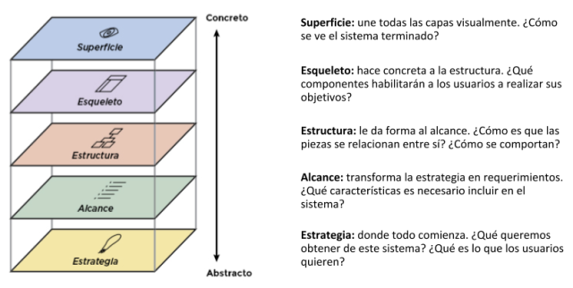
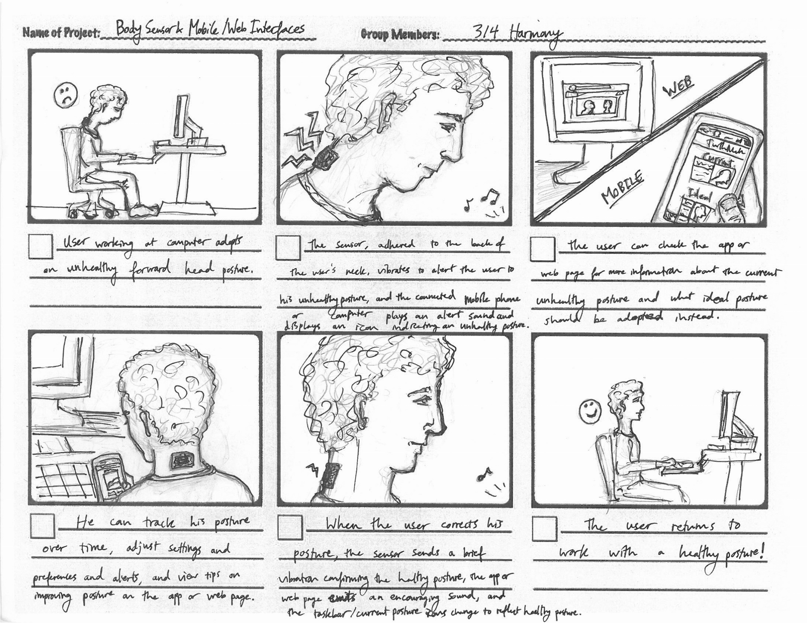
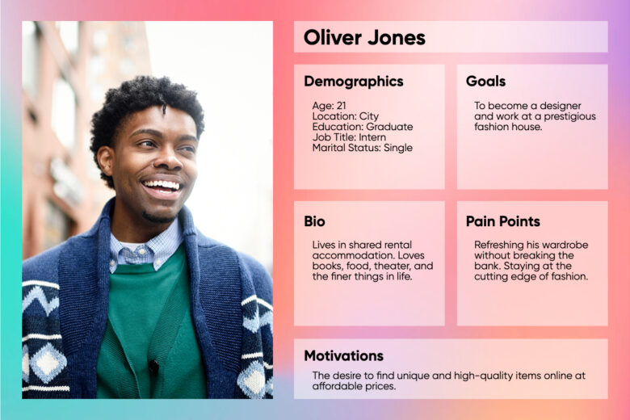
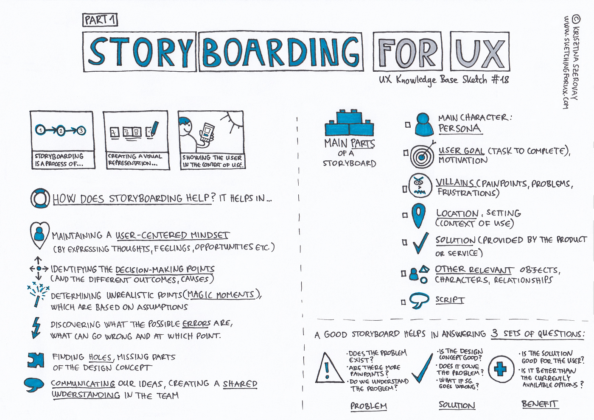
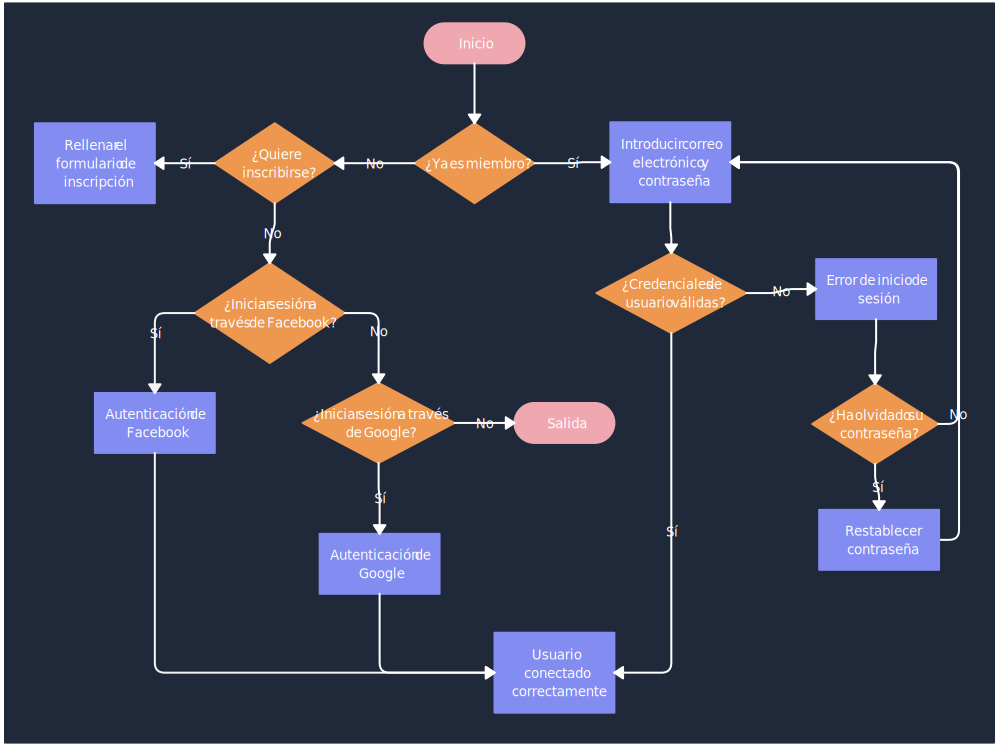

# Experiencia de Usuario (UX) y Usabilidad

### **1. Introducción a la UX y su Relación con Usabilidad y UI**

#### 1.1. ¿Qué es la UX (Experiencia de Usuario)?

La **experiencia de usuario (UX)** se refiere a cómo un usuario percibe y experimenta la interacción con un producto, servicio o sistema a lo largo de todo su recorrido. No se limita a una interacción puntual, sino que abarca cada aspecto del contacto del usuario con la marca: desde la primera impresión visual hasta la satisfacción obtenida después de usar el producto. La UX busca optimizar todos estos momentos para garantizar que el usuario encuentre valor, disfrute y facilidad en cada paso.

- **Algunos elementos de la UX**:
  - **Utilidad**: La capacidad del producto para resolver una necesidad real del usuario. Esto implica que el producto no solo funcione, sino que tenga una razón de ser que el usuario valore.
  - **Accesibilidad**: La facilidad con la que los usuarios de diferentes capacidades pueden acceder al producto. Esto es crucial para incluir a todos los posibles usuarios, asegurando que nadie se quede fuera debido a barreras físicas o tecnológicas.
  - **Diseño Emocional**: La conexión emocional que el producto establece con el usuario. Un buen diseño emocional puede hacer que el usuario se sienta comprendido y satisfecho, creando un vínculo más fuerte con la marca.
  - **Facilidad de Aprendizaje**: Qué tan rápido un usuario puede entender y utilizar el sistema. Esto es especialmente importante para productos que se espera que atraigan a una amplia variedad de usuarios, desde principiantes hasta expertos.

##### 1.1.1 **Diagrama de la Experiencia de Usuario de Peter Morville: The User Experience Honeycomb**

- **Descripción**: Creado por **Peter Morville**, este diagrama se conoce como el "Honeycomb" (panal de abeja) de la experiencia de usuario. Es un esquema muy famoso que destaca los siete elementos clave que se deben tener en cuenta al diseñar la experiencia de usuario de un producto o servicio.
- **Componentes del Honeycomb**:
  - **Useful (Útil)**: El producto debe ser útil para el usuario, cubriendo una necesidad.
  - **Usable (Usable)**: Debe ser fácil de usar, permitiendo que los usuarios alcancen sus objetivos con facilidad.
  - **Desirable (Deseable)**: El diseño debe ser atractivo y deseable, creando una conexión emocional.
  - **Findable (Encontrable)**: El producto debe ser fácil de encontrar por los usuarios.
  - **Accessible (Accesible)**: Debe ser accesible para personas con diferentes capacidades físicas y cognitivas.
  - **Credible (Creíble)**: Debe generar confianza y ser percibido como confiable por los usuarios.
  - **Valuable (Valioso)**: Debe aportar valor tanto al usuario como al negocio.
- **Importancia**: Este diagrama es popular porque ayuda a entender que la **UX** va más allá de la simple **usabilidad**. La **usabilidad** es solo un componente más de la experiencia de usuario, y es importante equilibrar todos los aspectos para ofrecer una experiencia completa y satisfactoria.

##### 1.1.2. **Diagrama de Garrett: The Elements of User Experience**

- **Asociado a: UX y Usabilidad**
- **Descripción**: Creado por **Jesse James Garrett** en su libro *The Elements of User Experience*, este esquema muestra cómo diferentes capas de un producto contribuyen a la experiencia del usuario. Se divide en cinco planos que van desde lo abstracto hasta lo concreto:
  - **Strategy (Estrategia)**: Las necesidades del usuario y los objetivos del negocio.
  - **Scope (Alcance)**: Funcionalidades y especificaciones de contenido.
  - **Structure (Estructura)**: Organización de la información y el diseño de la interacción.
  - **Skeleton (Esqueleto)**: Diseño de la interfaz, la navegación y la disposición de los elementos.
  - **Surface (Superficie)**: El diseño visual final, lo que los usuarios ven y con lo que interactúan.
- **Importancia**: Este modelo es muy utilizado para entender cómo se construye una experiencia de usuario desde la concepción de la idea hasta la interfaz final. Muestra la relación entre la usabilidad (estructura y esqueleto) y la experiencia completa (estrategia, alcance y superficie).

#### 1.2. Diferencias y Relaciones entre UX, Usabilidad y UI

La UX es un concepto amplio que incluye tanto la **usabilidad** como la **interfaz de usuario (UI)**. Es esencial entender las diferencias y la manera en la que estos conceptos se interrelacionan para diseñar productos que no solo sean funcionales, sino también atractivos y placenteros de usar.

- **UX (User Experience)**: Se enfoca en la **percepción global** y **las emociones** del usuario durante toda su interacción con un producto. No se trata solo de que el sistema funcione, sino de cómo se siente el usuario al usarlo, y cómo esto afecta su satisfacción y lealtad a la marca. La UX cubre todos los puntos de contacto del usuario con el sistema: desde la interfaz visual hasta el servicio de atención al cliente.
  
- **Usabilidad**: La usabilidad es un componente esencial de la UX que se centra en la **facilidad de uso** del sistema. Implica que un producto sea eficiente, efectivo y satisfactorio de utilizar. Mientras que la UX se ocupa de la percepción global del usuario, la usabilidad se encarga de que el usuario pueda realizar tareas específicas con el menor esfuerzo posible. Un sistema usable reduce la curva de aprendizaje y minimiza la frustración.

- **UI (User Interface)**: La interfaz de usuario (UI) se refiere a la **apariencia visual** y **la disposición de los elementos** con los que interactúa el usuario. Incluye colores, tipografías, iconografía, botones, menús y todos los elementos visuales que forman parte del producto. La UI es lo que el usuario ve, mientras que la usabilidad es cómo interactúa con lo que ve y la UX es cómo se siente al hacerlo.

#### 1.3. Factores Clave que Afectan a la UX

La experiencia de usuario está influenciada por múltiples factores que deben considerarse desde el inicio del diseño de un producto o servicio:

- **Simplicidad de la Interacción**: Reducir al mínimo el número de pasos que un usuario necesita para completar una tarea es fundamental. Esto significa eliminar procesos innecesarios que solo agregan complejidad.
  - **Ejemplo**: Un sitio de e-commerce que permite a los usuarios completar una compra en solo 2-3 pasos (seleccionar producto, ir al carrito y pagar) tiende a tener tasas de conversión más altas.
  
- **Consistencia del Diseño**: Mantener una apariencia y comportamiento uniformes a lo largo de todas las páginas y secciones de un producto es esencial para que el usuario no tenga que "aprender" nuevamente cómo usar cada parte del sistema.
  - **Ejemplo**: Aplicaciones como Slack y Trello mantienen un diseño consistente, lo cual facilita la navegación y ayuda a que los usuarios se sientan cómodos.

- **Feedback y Respuesta del Sistema**: El sistema debe proporcionar retroalimentación inmediata para que los usuarios sepan que sus acciones han sido reconocidas y procesadas.
  - **Ejemplo**: Animaciones de carga o mensajes de confirmación después de hacer clic en un botón de "Enviar" son ejemplos de feedback que mejoran la UX.

- **Tiempo de Carga y Rendimiento**: La velocidad a la que un sistema responde a las acciones del usuario es crucial. Un tiempo de carga lento puede arruinar una experiencia positiva y provocar que los usuarios abandonen el producto antes de interactuar con él.
  - **Ejemplo**: Google ha encontrado que un retraso de un segundo en el tiempo de carga de una página puede reducir las conversiones en un 7%.

#### 1.4. Importancia de la UX en el Desarrollo de Productos Digitales

La UX no es solo un complemento para un producto, sino que es fundamental para su **éxito a largo plazo**. Los productos que ofrecen una experiencia de usuario superior no solo satisfacen a sus usuarios actuales, sino que también atraen a nuevos usuarios y fomentan la lealtad.

- **Aumento de la Retención de Usuarios**: Los usuarios tienden a regresar a productos que les proporcionan una experiencia agradable y sin fricciones. Un buen ejemplo de esto es Spotify, que ofrece una experiencia de escucha fluida y adaptada a los gustos de cada usuario.
  
- **Reducción de Costos de Soporte**: Un producto intuitivo reduce la necesidad de asistencia técnica, ya que los usuarios pueden encontrar soluciones por sí mismos. Esto implica un menor costo para las empresas en términos de soporte y asistencia.
  
- **Mejora de la Percepción de la Marca**: Los usuarios asocian una experiencia de usuario positiva con una marca de calidad. Esto se traduce en usuarios leales que recomiendan el producto a otros, generando un efecto positivo en el boca a boca.
  - **Ejemplo**: Apple ha construido una reputación de marca sólida gracias a la consistencia de su UX, tanto en hardware como en software.

#### 1.5. Ejemplos de Buena y Mala UX

Los siguientes ejemplos destacan cómo la experiencia de usuario puede ser un factor decisivo en la aceptación o rechazo de un producto:

- **Ejemplos de Buena UX**:
  - **Dropbox**: Es conocido por su interfaz simple que permite a los usuarios sincronizar archivos entre dispositivos sin complicaciones. La curva de aprendizaje es casi inexistente, ya que los usuarios solo necesitan arrastrar y soltar archivos para comenzar a utilizarlos.
    - **¿Por qué es buena UX?**: Dropbox simplificó un proceso técnico, como la sincronización de archivos, y lo convirtió en algo accesible para usuarios no técnicos. Además, el diseño minimalista permite que la interfaz no distraiga de la tarea principal.
  
  - **Amazon’s 1-Click**: Amazon revolucionó el comercio electrónico con la patente del botón de "1-Click", que permite a los usuarios completar una compra con un solo clic.
    - **¿Por qué es buena UX?**: Este enfoque elimina la fricción del proceso de compra, mejorando la conversión y la experiencia del usuario, especialmente para aquellos que compran con frecuencia. Amazon entendió que la simplicidad en el proceso de compra era clave para mejorar la satisfacción del cliente.

  - **Airbnb**: La plataforma de alquileres temporales se caracteriza por su interfaz intuitiva, que permite a los usuarios encontrar alojamiento fácilmente mediante filtros personalizados.
    - **¿Por qué es buena UX?**: Airbnb ofrece a los usuarios una navegación clara y accesible, con fotos de alta calidad, reseñas detalladas y un proceso de reserva rápido. Esto hace que los usuarios se sientan seguros al reservar y encuentren lo que buscan con rapidez.

- **Ejemplos de Mala UX**:
  - **Snapchat Rediseño 2018**: Cuando Snapchat rediseñó su aplicación en 2018, eliminó la separación clara entre el contenido de amigos y el de influencers, mezclándolo todo en una misma sección.
    - **Impacto en la UX**: Los usuarios, acostumbrados a la navegación anterior, se sintieron desorientados y frustrados. La reacción negativa fue masiva, y muchos abandonaron la plataforma o firmaron peticiones para que volviera el diseño anterior.
    - **Lección de UX**: Los cambios drásticos en la interfaz deben ser graduales y considerar el feedback de los usuarios. Introducir modificaciones sin pruebas puede alejar a los usuarios leales.

  - **Apple’s Butterfly Keyboard**: Entre 2015 y 2019, Apple introdujo un teclado de mecanismo de mariposa en sus MacBooks que, aunque delgado y estéticamente agradable, resultó ser muy frágil.
    - **Impacto en la UX**: Las teclas se atascaban con facilidad, y la reparación era costosa debido a la integración del teclado con otros componentes del MacBook. Esto generó frustración entre los usuarios y dañó la percepción de calidad de Apple.
    - **Lección de UX**: La experiencia física del hardware también es parte de la UX. Priorizar la estética sobre la funcionalidad puede generar experiencias negativas que afectan la lealtad del cliente.

  - **Jabones de Hoteles**: Originalmente, ofrecer jabones individuales en los hoteles mejoraba la experiencia del usuario, asegurando un toque de lujo y personalización.
    - **Impacto en la UX**: Con el tiempo, los usuarios comenzaron a ver estos jabones como un símbolo de desperdicio ambiental. Esto se convirtió en un problema, especialmente cuando la sostenibilidad se volvió un valor importante para muchos viajeros.
    - **Lección de UX**: Una solución que inicialmente mejora la experiencia del usuario puede volverse negativa si las expectativas y preocupaciones de los usuarios cambian con el tiempo. Adaptarse a estas nuevas expectativas, como ofrecer dispensadores recargables y sostenibles, puede ser clave para mantener una buena percepción de la marca.

#### 1.6. **Ciclo de Evaluación de Usabilidad**

- **Descripción**: El ciclo de evaluación de usabilidad es un esquema que representa el proceso iterativo de mejora de la usabilidad de un producto. Se centra en cómo realizar pruebas de usabilidad y aplicar mejoras constantes al diseño.
- **Componentes Típicos**:
  - **Planificación**: Definir qué aspectos de la usabilidad se evaluarán y los métodos a utilizar (pruebas con usuarios, evaluaciones heurísticas, etc.).
  - **Pruebas de Usabilidad**: Realizar pruebas con usuarios reales para observar cómo interactúan con el producto y dónde encuentran problemas.
  - **Análisis**: Identificar los problemas de usabilidad a partir de las pruebas realizadas.
  - **Rediseño/Implementación de Mejoras**: Ajustar el diseño para solucionar los problemas encontrados.
  - **Iteración**: Repetir el proceso hasta que el producto alcance un nivel adecuado de usabilidad.
- **Importancia**: Este ciclo es fundamental para comprender que la usabilidad no es un objetivo que se alcanza de una vez, sino un proceso continuo de mejora. Es común encontrar este ciclo en libros y recursos sobre usabilidad y diseño centrado en el usuario.

---

### **2. Storyboards de UX y Flujos de Usuario**

#### 2.1. ¿Qué es un Storyboard de UX?

Un **storyboard de UX** es una herramienta visual que se utiliza para narrar la experiencia de un usuario mientras interactúa con un producto o servicio a lo largo de un escenario específico. Los storyboards muestran cómo un usuario se siente, qué problemas enfrenta, y qué soluciones encuentra mientras usa la aplicación o el sitio web.

- **Objetivo de los Storyboards de UX**:
  - Visualizar la experiencia del usuario a lo largo de diferentes momentos de interacción con el producto.
  - Identificar puntos de dolor (pain points) y oportunidades para mejorar la experiencia.
  - Ayudar a los equipos de diseño a pensar en las necesidades y expectativas de los usuarios desde una perspectiva más humana.

- **Elementos de un Storyboard de UX**:
  - **Personajes (User Personas)**: Son los protagonistas de la historia, basados en perfiles de usuario reales. Representan a los tipos de usuarios que utilizarán el producto.
  - **Contexto y Escenario**: Describe el entorno y las circunstancias en las que el usuario interactúa con el producto. Por ejemplo, si el usuario está en casa, en el trabajo, o de camino a algún lugar.
  - **Acciones del Usuario**: Los pasos que el usuario realiza mientras interactúa con el producto, como buscar información, realizar una compra, o registrarse en una plataforma.
  - **Interacciones Clave**: Describen cómo el usuario interactúa con la interfaz en cada paso, como hacer clic en un botón, desplazarse por una lista, o leer un mensaje de error.
  - **Emociones del Usuario**: Las reacciones emocionales que experimenta el usuario en cada etapa, como frustración, alegría, sorpresa, o satisfacción.

##### 2.1.1 Personajes (User Personas)

El concepto de **"persona"** es fundamental en la creación de **user storyboards** y otras herramientas de diseño centrado en el usuario, como los flujos de usuario y la experiencia de usuario (UX) en general. Las **personas** ayudan a los equipos de diseño y desarrollo a **enfocar el diseño** en las necesidades y expectativas de los usuarios reales, brindando una representación más tangible de los distintos tipos de usuarios que podrían interactuar con un producto o servicio. 

###### 2.1.1.1. **¿Qué es una Persona?**

Una **persona** es una representación ficticia pero realista de un grupo de usuarios típicos que comparten características, comportamientos, motivaciones y necesidades similares al interactuar con un producto o servicio. Se basan en **investigaciones** y **datos reales** recopilados a través de encuestas, entrevistas, estudios de campo, y análisis de comportamiento de usuarios. Las personas permiten a los diseñadores y desarrolladores mantener un enfoque en las necesidades de los usuarios al tomar decisiones de diseño.

- **Descripción General**: Las personas incluyen un nombre, una breve biografía, y características demográficas (edad, género, ocupación, lugar de residencia). A menudo, se presentan con una imagen para humanizarlas y hacerlas más identificables para el equipo de diseño.
- **Motivaciones y Necesidades**: Se describen los objetivos y las razones por las que el usuario querría interactuar con el producto. Esto podría incluir la necesidad de realizar una tarea de manera más rápida, el deseo de encontrar un producto específico o la motivación de entretenerse.
- **Comportamientos y Hábitos**: Cómo interactúan con la tecnología y qué tipo de dispositivos prefieren (por ejemplo, un usuario que prefiere usar su móvil para la mayoría de las tareas). También pueden incluir sus hábitos de navegación, si son más meticulosos o más impulsivos, y cómo prefieren consumir información.
- **Frustraciones y Puntos de Dolor**: Los problemas comunes que estos usuarios enfrentan cuando utilizan productos similares, como interfaces complicadas, falta de claridad en las instrucciones o procesos de pago demasiado largos.
  

###### 2.1.1.2. **¿Por Qué Son Importantes las Personas en los Storyboards de UX?**

En el contexto de los **user storyboards**, las personas son clave para crear **historias centradas en el usuario** que representen de manera fiel cómo estos usuarios interactúan con un producto. Esto es fundamental para garantizar que el diseño del producto o servicio sea relevante y satisfactorio para los usuarios.

- **Enfoque en el Usuario Real**: Las personas ayudan a que el equipo de diseño se mantenga enfocado en las necesidades y características del usuario real, en lugar de diseñar para un usuario genérico o para ellos mismos. Esto permite crear soluciones que realmente resuelvan los problemas y satisfagan las expectativas de los usuarios.
- **Creación de Escenarios Realistas**: En los storyboards de UX, cada escena muestra un paso en la interacción de la persona con el producto. Al definir claramente quién es el usuario (a través de una persona), se puede describir con mayor precisión el contexto de uso y las acciones que realiza.
- **Empatía y Comprensión del Usuario**: Las personas permiten que los diseñadores y desarrolladores se pongan en el lugar del usuario, entendiendo mejor sus frustraciones, preocupaciones y expectativas. Esto facilita la creación de interfaces y experiencias que sean intuitivas y satisfactorias.

###### 2.1.1.3. **¿Cómo se Construye una Persona?**

Para crear una persona, es necesario recopilar información relevante sobre los usuarios. Aquí algunos pasos comunes en la construcción de una persona:

1. **Investigación de Usuarios**:
   - Realizar entrevistas, encuestas y observaciones de usuarios.
   - Analizar datos cuantitativos (como estadísticas de uso) y cualitativos (como opiniones de usuarios).
   - Estudiar las necesidades, motivaciones y comportamientos de los usuarios a través de grupos focales o estudios de campo.

2. **Segmentación de Usuarios**:
   - Identificar diferentes segmentos de usuarios con características y necesidades similares.
   - Por ejemplo, en una plataforma de e-learning, podría haber estudiantes universitarios que buscan cursos de especialización, adultos que buscan cambiar de carrera, y profesores que quieren ofrecer sus cursos.

3. **Creación del Perfil de la Persona**:
   - **Nombre y Foto**: Elegir un nombre realista y una imagen que represente a la persona. Esto ayuda a humanizarla y hacerla más fácil de recordar.
   - **Biografía Breve**: Un resumen de la vida y el contexto de la persona, que incluye su situación familiar, laboral y algunas características personales.
   - **Objetivos y Motivaciones**: Definir claramente qué espera lograr la persona al usar el producto. Por ejemplo, “María quiere encontrar cursos de marketing digital para mejorar sus habilidades y encontrar un nuevo trabajo”.
   - **Frustraciones**: Identificar los puntos de dolor y frustraciones comunes que enfrenta la persona. Por ejemplo, “María se siente frustrada cuando los cursos no tienen una estructura clara o cuando el sitio web tarda demasiado en cargar”.

4. **Uso en el Proceso de Diseño**:
   - Integrar las personas en el desarrollo de storyboards para representar cómo cada tipo de usuario podría interactuar con el producto.
   - Referirse a las personas durante las reuniones de diseño y desarrollo para mantener el enfoque en las necesidades reales de los usuarios.

###### 2.1.1.4. **Ejemplo de una Persona para un User Storyboard**

**Nombre**: Pedro Gutiérrez  
**Edad**: 35 años  
**Ocupación**: Consultor de Marketing Digital  
**Contexto de Uso**: Utiliza su smartphone y su portátil para trabajar desde casa. Suele buscar cursos en línea para mantenerse actualizado en su campo y prefiere plataformas que sean rápidas y fáciles de navegar. Le gusta aprender a su propio ritmo y valora los cursos que tienen una estructura clara y ofrecen certificados.  
**Objetivos**: 
- Acceder rápidamente a nuevos cursos en su área de especialización.
- Encontrar contenido de alta calidad que le ayude a mejorar sus habilidades.
- Obtener un certificado para agregar a su perfil de LinkedIn.
**Frustraciones**: 
- Los sitios web que no son intuitivos o que requieren muchos pasos para acceder al contenido.
- Cursos que no cumplen con las expectativas o que son difíciles de seguir.
- Falta de claridad en los precios y ofertas de suscripción.
  
###### 2.1.1.5. **Aplicación de la Persona en un User Storyboard**

Cuando se utiliza a **Pedro** en un user storyboard, se puede visualizar cómo interactúa con una plataforma de e-learning:

1. **Escenario inicial**:
   - **Contexto**: Pedro está en casa buscando un curso de marketing avanzado en su portátil.
   - **Emoción**: Se siente motivado y busca mejorar sus habilidades para destacarse en su trabajo.

2. **Búsqueda de cursos**:
   - **Acción**: Pedro accede a la plataforma de e-learning y utiliza el buscador para encontrar cursos de “marketing digital avanzado”.
   - **Interacción**: Escribe el término en el buscador y revisa los resultados.
   - **Emoción**: Se siente satisfecho porque los resultados se cargan rápidamente y el filtro le permite ordenar los cursos por popularidad.

3. **Comparación de opciones**:
   - **Acción**: Pedro compara varios cursos y revisa las reseñas.
   - **Interacción**: Despliega las opiniones de otros usuarios para ver si el curso cumple con lo que busca.
   - **Emoción**: Se siente algo indeciso, pero las reseñas detalladas y el acceso a un certificado le ayudan a tomar una decisión.

4. **Proceso de compra**:
   - **Acción**: Pedro elige un curso y procede al pago.
   - **Interacción**: Ingresa su información de pago y selecciona una oferta de suscripción mensual.
   - **Emoción**: Se siente tranquilo porque el proceso de compra fue claro y no se presentaron cargos ocultos.

5. **Inicio del curso**:
   - **Acción**: Pedro comienza el curso y accede a los materiales.
   - **Interacción**: Encuentra el contenido estructurado en módulos y con un cronograma sugerido.
   - **Emoción**: Se siente satisfecho porque el curso cumple con sus expectativas y está bien organizado.

En este storyboard, la **persona** de Pedro guía la narrativa, ayudando a los diseñadores a entender cómo un usuario como él podría experimentar cada etapa del proceso. Las decisiones de diseño, como la estructura de los módulos del curso y la claridad en el proceso de pago, se ajustan a las necesidades y expectativas de Pedro, lo que mejora su experiencia en la plataforma.

###### 2.1.1.6. **Beneficios de Usar Personas en Storyboards**

- **Humanización del Proceso de Diseño**: Las personas hacen que el proceso de diseño sea más humano y menos abstracto. Al pensar en Pedro y sus necesidades, el equipo puede crear soluciones más específicas y relevantes.
- **Orientación de las Decisiones de Diseño**: Al referirse constantemente a las personas, se asegura que cada decisión de diseño tenga un propósito claro y esté alineada con las necesidades de los usuarios reales.
- **Validación de Ideas y Prototipos**: Las personas ayudan a validar si una nueva funcionalidad o cambio en el diseño realmente mejorará la experiencia del usuario, al comparar las propuestas con lo que la persona necesita y espera.

#### 2.2. Beneficios de Utilizar Storyboards de UX

Los storyboards de UX son una herramienta poderosa para los diseñadores y desarrolladores porque permiten visualizar cómo un usuario típico experimenta el producto. Esto facilita el diseño de soluciones más empáticas y centradas en el usuario. A continuación, se presentan algunos de los principales beneficios:

- **Visualización de la Experiencia Completa**: Permiten a los diseñadores entender cómo un usuario se siente en cada etapa de su interacción, lo cual es fundamental para identificar áreas de mejora y diseñar experiencias más satisfactorias.
  
- **Identificación de Puntos de Dolor**: Los storyboards ayudan a visualizar problemas específicos que el usuario podría enfrentar al interactuar con el producto. Esto permite a los equipos de diseño y desarrollo anticipar y resolver problemas antes de que el producto llegue a los usuarios finales.
  
- **Comunicación Clara entre Equipos**: Los storyboards son una herramienta visual que facilita la comunicación entre los diferentes miembros del equipo, desde diseñadores y desarrolladores hasta marketing y stakeholders. Esto asegura que todos tengan una visión compartida de cómo debería ser la experiencia del usuario.
  
- **Generación de Ideas para el Diseño**: Al visualizar el recorrido del usuario, los equipos pueden identificar nuevas funcionalidades o mejoras en la interfaz que podrían enriquecer la experiencia del usuario.

#### 2.3. Ejemplo de Storyboard de UX

Imagina un storyboard para un **usuario que desea reservar un vuelo a través de una aplicación móvil de viajes**. Este storyboard podría incluir las siguientes etapas:

1. **Escenario inicial**:
   - **Personaje**: Pedro, un profesional de 35 años, que necesita reservar un vuelo para una reunión de trabajo.
   - **Contexto**: Pedro está en su oficina, usando su teléfono móvil para buscar opciones de vuelo.
   - **Emoción**: Se siente apresurado porque necesita encontrar un vuelo rápido que se ajuste a su horario.

2. **Búsqueda de vuelos**:
   - **Acción**: Pedro abre la aplicación de viajes y utiliza el buscador para encontrar vuelos desde Madrid a París.
   - **Interacción**: Escribe "Madrid" como origen y "París" como destino, elige fechas de ida y vuelta, y aplica un filtro de vuelos directos.
   - **Emoción**: Se siente aliviado al ver que la aplicación responde rápido y le muestra varias opciones.

3. **Comparación de opciones**:
   - **Acción**: Pedro revisa las opciones de vuelo, compara precios y horarios.
   - **Interacción**: Desliza hacia abajo para ver todas las opciones y utiliza un filtro para ordenar por "Menor precio".
   - **Emoción**: Se siente indeciso porque hay muchas opciones similares, pero la interfaz le facilita la comparación.

4. **Selección y pago**:
   - **Acción**: Pedro selecciona un vuelo y procede al pago.
   - **Interacción**: Ingresa su tarjeta de crédito y verifica los detalles del vuelo antes de confirmar.
   - **Emoción**: Se siente frustrado porque la aplicación le pide demasiados datos adicionales antes de completar el pago.

5. **Confirmación de la reserva**:
   - **Acción**: Pedro recibe un mensaje de confirmación con los detalles de su vuelo.
   - **Interacción**: Revisa el mensaje y guarda el código de reserva.
   - **Emoción**: Se siente satisfecho y tranquilo al saber que su reserva está asegurada.

Cada uno de estos pasos se puede representar con ilustraciones simples o descripciones visuales en un storyboard de UX, mostrando cómo Pedro experimenta la aplicación de viajes en cada etapa.

#### 2.4. ¿Qué son los Flujos de Usuario?

Los **flujos de usuario** (User Flows) son diagramas que representan el recorrido de un usuario a través de una aplicación o sitio web para completar una tarea específica. Son complementarios a los storyboards, pero se centran más en los pasos lógicos y las decisiones que el usuario toma en cada interacción.

- **Objetivo de los Flujos de Usuario**:
  - Visualizar todos los pasos y decisiones que un usuario realiza para completar una tarea específica, como registrarse, realizar una compra o enviar un mensaje.
  - Identificar los puntos donde el usuario podría enfrentarse a problemas o bloqueos en su recorrido.
  - Optimizar la experiencia de usuario reduciendo la cantidad de pasos y decisiones innecesarias.

- **Elementos de un Flujo de Usuario**:
  - **Inicio**: El punto donde comienza la interacción (por ejemplo, la página de inicio o la pantalla de inicio de sesión).
  - **Acciones**: Las acciones que el usuario realiza en cada paso, como hacer clic en un botón, rellenar un formulario, o seleccionar una opción.
  - **Decisiones**: Puntos donde el usuario toma decisiones que lo llevan por diferentes caminos, como elegir entre crear una cuenta o iniciar sesión.
  - **Fin**: El objetivo final de la tarea, como la confirmación de un pedido o la creación de una cuenta.

#### 2.5. Beneficios de Utilizar Flujos de Usuario

Los flujos de usuario son esenciales para optimizar la experiencia de usuario, ya que ayudan a los diseñadores y desarrolladores a comprender cómo los usuarios interactúan con el sistema y a identificar posibles mejoras. A continuación, se detallan algunos beneficios:

- **Optimización de la Experiencia de Usuario**: Permiten identificar cuellos de botella y pasos innecesarios en el proceso, lo que ayuda a simplificar el recorrido del usuario y a eliminar fricciones.
  
- **Mejora de la Arquitectura de la Información**: Al visualizar todos los pasos que sigue un usuario, los diseñadores pueden organizar mejor la estructura del contenido y la navegación.
  
- **Priorización de Funcionalidades**: Los flujos de usuario ayudan a identificar qué pantallas o funcionalidades son críticas para la experiencia del usuario, permitiendo a los equipos priorizar su diseño y desarrollo.
  
- **Reducción de la Curva de Aprendizaje**: Al simplificar el flujo de usuario, se hace que la aplicación o el sitio sea más intuitivo, reduciendo el tiempo que un usuario necesita para aprender a usarlo.

#### 2.6. Ejemplo de Flujo de Usuario

Imagina un flujo de usuario para **registrarse en una plataforma de streaming de video**. Los pasos podrían ser:

1. **Inicio**: Página de inicio de la plataforma con un botón de "Regístrate".
2. **Acción**: Usuario hace clic en "Regístrate".
3. **Acción**: Usuario rellena el formulario con su correo electrónico, contraseña y nombre.
4. **Decisión**: ¿El usuario ha completado todos los campos obligatorios?
   - **Sí**: Hace clic en "Siguiente".
   - **No**: El sistema muestra un mensaje de error indicando los campos incompletos.
5. **Acción**: Usuario selecciona el plan de suscripción que desea.
6. **Acción**: Introduce los detalles de pago y hace clic en "Confirmar".
7. **Fin**: El usuario recibe un mensaje de bienvenida y acceso a su nueva cuenta.

Este flujo muestra todos los pasos necesarios para que un usuario se registre, indicando los posibles puntos de bloqueo (como un formulario incompleto) y las decisiones que afectan su recorrido.

---

### 3. **Introducción a la Usabilidad**

#### 3.1. Definición de Usabilidad y sus Principios

La **usabilidad** es una medida de la facilidad con la que un sistema, producto o servicio puede ser utilizado por usuarios específicos para alcanzar objetivos específicos de manera **efectiva**, **eficiente** y **satisfactoria** en un contexto determinado de uso. Es un componente fundamental de la experiencia de usuario (UX), ya que determina la simplicidad con la que un usuario puede interactuar con una interfaz.

- **Efectividad**: Se refiere a la capacidad del usuario de lograr sus objetivos al interactuar con el sistema. Una interfaz efectiva permite a los usuarios completar tareas sin errores o con un número mínimo de errores.
  - **Ejemplo**: Si un usuario quiere comprar un producto en un sitio de e-commerce, la efectividad se mide en si logra finalizar la compra sin problemas, desde la búsqueda del producto hasta la confirmación de la transacción.
  
- **Eficiencia**: Relacionada con la cantidad de tiempo y esfuerzo que el usuario necesita invertir para alcanzar su objetivo. Un sistema eficiente minimiza el tiempo requerido para completar tareas.
  - **Ejemplo**: Un proceso de registro que solicita solo la información esencial para crear una cuenta, como el correo electrónico y la contraseña, es más eficiente que uno que pide detalles como dirección postal, número de teléfono y preferencias desde el inicio.
  
- **Satisfacción**: La percepción positiva del usuario al utilizar un sistema. Un producto que cumple con las expectativas del usuario, eliminando frustraciones y proporcionando una experiencia fluida, tiende a generar una mayor satisfacción.
  - **Ejemplo**: Un sitio web que carga rápidamente y tiene un diseño visual atractivo y coherente puede hacer que el usuario disfrute la experiencia de uso, sintiéndose satisfecho con la interfaz.

#### 3.2. Impacto de la Usabilidad en la UX

La **usabilidad** y la **UX** están estrechamente relacionadas, ya que una interfaz usable es la base sobre la cual se construye una experiencia de usuario positiva. Sin embargo, una buena usabilidad por sí sola no garantiza una experiencia de usuario satisfactoria. La usabilidad se centra en la simplicidad y la eficiencia de las interacciones, mientras que la UX considera también los aspectos emocionales y de satisfacción.

- **Una interfaz usable no siempre es memorable**: La usabilidad asegura que los usuarios puedan realizar tareas fácilmente, pero la UX busca que esas interacciones sean placenteras y significativas. Un sistema puede ser funcional y sencillo, pero si no genera emociones positivas o no sorprende al usuario, puede ser percibido como "aburrido" o "frío".

- **Una interfaz con mala usabilidad siempre tiene una mala UX**: Si los usuarios se frustran al intentar completar una tarea debido a problemas de usabilidad, como formularios confusos o botones mal etiquetados, la experiencia global del usuario será negativa, aunque otros elementos de la UX sean buenos.
  - **Ejemplo**: Imagina un sitio web de banca en línea que tiene un diseño visual moderno y atractivo (buena UI), pero el proceso de transferencia de dinero es complejo y requiere varios pasos innecesarios (mala usabilidad). La experiencia del usuario será frustrante a pesar de la buena apariencia del sitio.

#### 3.3. Principales Métricas de Usabilidad: Eficiencia, Efectividad y Satisfacción

Para evaluar la usabilidad de un sistema, es importante utilizar métricas que nos permitan medir y cuantificar los aspectos más relevantes. Las **tres métricas fundamentales** para medir la usabilidad son:

1. **Eficiencia**:
   - **Descripción**: Mide el tiempo que un usuario necesita para completar una tarea después de haber aprendido a usar el sistema. Un sistema eficiente permite a los usuarios realizar sus tareas en el menor tiempo posible.
   - **Cómo medirla**: Se puede calcular el tiempo promedio que toma a un grupo de usuarios realizar una tarea específica y compararlo con un tiempo de referencia o el tiempo de otros sistemas similares.
   - **Ejemplo**: Un sitio web que permite a los usuarios encontrar y descargar un documento en menos de 30 segundos tiene una alta eficiencia.

2. **Efectividad**:
   - **Descripción**: Mide el grado en que los usuarios pueden completar tareas y alcanzar sus objetivos sin errores. Un sistema efectivo es aquel en el que los usuarios logran sus metas de manera consistente.
   - **Cómo medirla**: Se puede calcular el porcentaje de tareas completadas exitosamente por un grupo de usuarios durante una prueba de usabilidad. También se puede medir la cantidad de errores que cometen los usuarios durante el proceso.
   - **Ejemplo**: Un asistente virtual que entiende correctamente las solicitudes de los usuarios el 95% de las veces se considera efectivo.

3. **Satisfacción**:
   - **Descripción**: Mide el nivel de satisfacción y disfrute que experimenta un usuario al interactuar con un sistema. Un sistema satisfactorio deja una impresión positiva en los usuarios, haciendo que quieran regresar a usarlo.
   - **Cómo medirla**: Se puede medir utilizando encuestas de satisfacción, como el **System Usability Scale (SUS)**, que proporciona una puntuación sobre la percepción de la usabilidad y la satisfacción del usuario.
   - **Ejemplo**: Una aplicación móvil de gestión de tareas que recibe calificaciones positivas en las tiendas de aplicaciones (como "me gusta lo fácil que es organizar mis tareas") refleja una alta satisfacción del usuario.

#### 3.4.  Principios de Usabilidad de Jakob Nielsen**

Jakob Nielsen, un experto en usabilidad y cofundador de la consultora Nielsen Norman Group, es conocido por sus diez principios heurísticos de usabilidad, que constituyen una referencia esencial en el diseño de interfaces de usuario. Estos principios no son reglas estrictas, sino directrices que ayudan a evaluar y mejorar la usabilidad de sistemas, interfaces y productos digitales. 

#### 3.4.1. Visibilidad del Estado del Sistema

El sistema debe mantener a los usuarios informados sobre lo que está ocurriendo en todo momento, proporcionando feedback oportuno y adecuado. Esto ayuda a que el usuario mantenga el control y se sienta cómodo al interactuar con la interfaz.

- **Ejemplo**: Un sitio de comercio electrónico que muestra un mensaje de confirmación después de que el usuario realiza una compra. Este mensaje asegura al usuario que su acción se completó con éxito.

#### 3.4.2. Correlación entre el Sistema y el Mundo Real

El diseño debe hablar el lenguaje del usuario y utilizar términos, frases y conceptos familiares. Los elementos visuales y la organización de la información deben alinearse con la manera en la que el usuario piensa y trabaja, evitando jergas técnicas o términos ambiguos.

- **Ejemplo**: En un sistema de gestión de documentos, utilizar términos como “Guardar”, “Eliminar” y “Buscar” en lugar de palabras técnicas que puedan ser confusas para el usuario.

#### 3.4.3. Control y Libertad del Usuario

Los usuarios necesitan tener opciones para deshacer y rehacer acciones, permitiéndoles explorar la interfaz sin temor a cometer errores graves. Esto ayuda a generar confianza en el sistema y reduce la ansiedad del usuario.

- **Ejemplo**: Un sitio web de banca en línea que permite cancelar o corregir una transacción antes de finalizarla.

#### 3.4.4. Consistencia y Estándares

Los usuarios no deberían tener que cuestionarse si palabras, acciones o situaciones diferentes significan lo mismo. Es esencial seguir convenciones de la industria y mantener la consistencia en los términos, colores, estilos y comportamientos de la interfaz.

- **Ejemplo**: En una plataforma de redes sociales, el uso del icono de "corazón" para indicar "me gusta" debe ser coherente en todas las secciones de la plataforma.

#### 3.4.5. Prevención de Errores

Es preferible diseñar la interfaz de manera que los usuarios no cometan errores, en lugar de proporcionar mensajes de error. Esto puede lograrse mediante validaciones en tiempo real, mensajes de advertencia y un diseño intuitivo que guíe al usuario.

- **Ejemplo**: Un formulario de registro que indique en tiempo real si la contraseña ingresada cumple con los requisitos de seguridad.

#### 3.4.6. Reconocimiento en Lugar de Memorización

Es importante minimizar la carga cognitiva, haciendo visibles los objetos, acciones y opciones necesarias para la tarea en curso. El usuario no debería tener que recordar información entre distintas partes de la interfaz.

- **Ejemplo**: Un menú desplegable que muestra las opciones disponibles en lugar de hacer que el usuario las recuerde o las escriba manualmente.

#### 3.4.7. Flexibilidad y Eficiencia de Uso

Una interfaz debe ser eficiente tanto para los usuarios novatos como para los experimentados. Esto se puede lograr proporcionando accesos directos, atajos de teclado y personalización de la interfaz para que los usuarios avanzados puedan realizar sus tareas más rápidamente.

- **Ejemplo**: Un programa de edición de texto que permite el uso de atajos de teclado para funciones comunes, como copiar y pegar.

#### 3.4.8. Estética y Diseño Minimalista

El diseño de la interfaz debe centrarse en lo esencial, eliminando cualquier elemento innecesario que distraiga al usuario o complique su tarea. La simplicidad y la claridad son claves para una buena usabilidad.

- **Ejemplo**: Una aplicación de gestión de tareas que utiliza un diseño limpio y sencillo, donde cada función tiene un propósito claro y relevante para el usuario.

#### 3.4.9. Ayuda para Reconocer, Diagnosticar y Recuperarse de Errores

Los mensajes de error deben ser claros y ofrecer posibles soluciones para ayudar al usuario a entender y corregir el problema. Es fundamental evitar los mensajes de error técnicos que puedan confundir a los usuarios no expertos.

- **Ejemplo**: Un sitio web de reservas de hotel que muestra un mensaje claro cuando el usuario intenta reservar una habitación en fechas no disponibles, y le sugiere fechas alternativas.

#### 3.4.10. Ayuda y Documentación

Aunque es ideal que el sistema sea lo suficientemente intuitivo para que los usuarios no necesiten ayuda, es importante proporcionar documentación y asistencia cuando sea necesario. Esta ayuda debe ser fácil de buscar, centrarse en las tareas del usuario y proporcionar instrucciones claras y concisas.

- **Ejemplo**: Un software de edición de imágenes que ofrece tutoriales y una guía de usuario accesible desde el menú de ayuda.

#### 6.11. Importancia de los Principios de Jakob Nielsen

Los principios de usabilidad de Jakob Nielsen son esenciales para evaluar la usabilidad de un sistema y mejorar la experiencia de usuario. Aplicarlos permite crear interfaces intuitivas, eficientes y agradables, que minimizan la frustración y maximizan la satisfacción del usuario.

#### 3.5. Ejemplos de Buena Usabilidad

- **Google Search**:
  - **Descripción**: El motor de búsqueda de Google es un ejemplo clásico de buena usabilidad. Su interfaz minimalista permite a los usuarios realizar búsquedas sin distracciones y obtener resultados relevantes en fracciones de segundo.
  - **Principios Aplicados**: Simplicidad, velocidad y reconocimiento sobre memorización (el usuario no necesita saber cómo funciona el motor, solo escribir su consulta).

- **Duolingo**:
  - **Descripción**: Duolingo, la popular aplicación para aprender idiomas, facilita a los usuarios avanzar a su propio ritmo, ofrece retroalimentación inmediata y utiliza un diseño consistente.
  - **Principios Aplicados**: Visibilidad del estado del sistema (el progreso se muestra claramente), prevención de errores (las respuestas incorrectas se corrigen en tiempo real) y satisfacción del usuario (la gamificación hace que el aprendizaje sea divertido).

- **Stripe (Plataforma de Pagos)**:
  - **Descripción**: Stripe es una plataforma de pagos que ofrece una interfaz intuitiva para desarrolladores y empresas. Su documentación clara y su API fácil de integrar han sido fundamentales para su éxito.
  - **Principios Aplicados**: Consistencia y estándares, control del usuario (facilidad para personalizar la experiencia de pago) y prevención de errores (documentación detallada que ayuda a evitar problemas comunes).

---

### **4. Arquitectura de la Información**

#### 4.1. Definición de Arquitectura de la Información

La **Arquitectura de la Información (IA)** se refiere a la organización, disposición y estructuración de la información en un sitio web, una aplicación o un sistema digital. Su objetivo es que los usuarios puedan encontrar y comprender la información que necesitan de forma fácil y rápida, facilitando la navegación y mejorando la experiencia de usuario (UX). 

La arquitectura de la información se ocupa de cómo se agrupan, etiquetan y organizan los elementos de contenido, así como de la definición de rutas de navegación claras y coherentes.

- **Objetivo de la Arquitectura de la Información**:
  - Ayudar a los usuarios a encontrar lo que buscan de manera rápida y sencilla.
  - Reducir la carga cognitiva al organizar el contenido de manera lógica.
  - Aumentar la eficiencia del usuario al minimizar la necesidad de explorar múltiples secciones antes de encontrar la información.

- **Importancia de la Arquitectura de la Información**:
  - Mejora la **usabilidad** del sistema al permitir que los usuarios encuentren la información que necesitan con menos esfuerzo.
  - Aumenta la **retención de usuarios**, ya que una estructura clara evita la frustración y hace que los usuarios regresen.
  - **Facilita el SEO**, ya que los motores de búsqueda entienden mejor la organización del contenido, mejorando la indexación y el posicionamiento en las búsquedas.

#### 4.2. Principios de la Arquitectura de la Información

La arquitectura de la información se basa en varios principios fundamentales que permiten organizar y estructurar el contenido de manera que sea accesible y comprensible para el usuario. A continuación, se detallan los más importantes:

##### 4.2.1. **Jerarquía**

La **jerarquía** es la organización del contenido en niveles de importancia, desde los elementos más generales a los más específicos. Esto permite que los usuarios naveguen a través de categorías amplias y profundicen en contenido más detallado según sus necesidades.

- **Características de una buena jerarquía**:
  - **Claridad**: Las categorías principales deben ser comprensibles y representar claramente el tipo de contenido que agrupan.
  - **Profundidad controlada**: Es importante evitar estructuras demasiado profundas (muchos niveles de subcategorías), ya que pueden confundir a los usuarios. Se recomienda un equilibrio de profundidad y amplitud.
  - **Consistencia**: La estructura jerárquica debe ser consistente a lo largo del sistema para evitar confusiones.

- **Ejemplo de jerarquía**: 
  - Un sitio de e-commerce podría tener la siguiente estructura:
    - **Inicio**
    - **Categorías de productos**
      - Electrónica
        - Móviles
          - iPhone
          - Samsung
        - Televisores
          - LED
          - OLED
      - Ropa
        - Hombres
          - Camisas
          - Pantalones
        - Mujeres
          - Vestidos
          - Blusas
    - **Carrito**
    - **Mi Cuenta**
    - **Contacto**

Este tipo de organización permite a los usuarios navegar desde categorías generales (como "Electrónica") hasta productos específicos (como "Samsung Galaxy S21") de manera fluida y rápida.

##### 4.2.2. **Agrupación Lógica**

La **agrupación lógica** consiste en organizar elementos que comparten características comunes para que los usuarios los perciban como parte de un mismo grupo. Esto ayuda a reducir la carga cognitiva, ya que los usuarios no tienen que procesar cada elemento por separado, sino que pueden identificar patrones y asociaciones.

- **Tipos de agrupación**:
  - **Agrupación por similitud**: Colocar juntos elementos que tienen características similares. Ejemplo: Agrupar todos los productos de la categoría "Electrónica" en una sección de la tienda online.
  - **Agrupación funcional**: Organizar elementos según su función. Ejemplo: En un panel de administración, agrupar las opciones de "Gestión de usuarios", "Configuración", y "Estadísticas" bajo un menú de "Administración".
  - **Agrupación visual**: Utilizar el diseño visual (espacios en blanco, colores, bordes) para crear la percepción de agrupamiento entre elementos relacionados. Ejemplo: En un formulario, agrupar campos relacionados como "Nombre", "Apellido" y "Correo electrónico" en una sección de "Información Personal".

- **Ejemplo de Agrupación Lógica**:
  - En un sitio de noticias, los artículos podrían agruparse por categorías como "Tecnología", "Salud", "Deportes", y "Política", de modo que los usuarios interesados en un tema específico puedan encontrar rápidamente los artículos relacionados.

##### 4.2.3. **Navegabilidad**

La **navegabilidad** es la facilidad con la que un usuario puede moverse por un sitio web o aplicación para encontrar la información que busca. La arquitectura de la información juega un papel crucial en la creación de rutas de navegación claras y coherentes que faciliten el desplazamiento del usuario por el sistema.

- **Elementos de la Navegabilidad**:
  - **Menús de navegación**: Deben ser visibles y presentar las principales secciones de manera clara y accesible. Es importante que los menús sean consistentes en todas las páginas para que los usuarios no pierdan el contexto.
  - **Breadcrumbs**: Proporcionan un rastro de navegación, indicando a los usuarios en qué sección del sitio se encuentran y permitiéndoles regresar a niveles anteriores. Son útiles para sitios con múltiples niveles de categorías.
  - **Mapas de sitio (Sitemaps)**: Permiten visualizar la estructura completa del sitio, tanto para usuarios como para motores de búsqueda, facilitando el acceso a diferentes secciones.

- **Ejemplo de buena navegabilidad**:
  - Un sitio web de recetas que ofrece un menú con categorías como "Desayunos", "Almuerzos", "Cenas", y "Postres", junto con un buscador que permite a los usuarios encontrar recetas específicas. Además, muestra un breadcrumb que indica la ruta: "Inicio > Recetas > Postres > Brownies de Chocolate".

#### 4.3. Ejemplos Prácticos de Arquitectura de la Información

Para consolidar el concepto de arquitectura de la información, es útil analizar ejemplos concretos de sitios web y aplicaciones que implementan estos principios de manera efectiva:

- **Ejemplo 1: Amazon**  
  - **Jerarquía**: Amazon utiliza una estructura jerárquica compleja que permite a los usuarios navegar desde categorías generales, como "Electrónica" o "Ropa", hasta productos específicos. Las subcategorías y filtros ayudan a afinar la búsqueda, como "Móviles > Android > Samsung".
  - **Agrupación Lógica**: Los productos se agrupan de forma lógica dentro de cada categoría, y se destacan opciones relacionadas como "Los más vendidos" o "Recomendados para ti".
  - **Navegabilidad**: Los usuarios tienen acceso a un menú superior que permanece constante, breadcrumbs en páginas de productos, y una barra de búsqueda que facilita encontrar cualquier producto.

- **Ejemplo 2: Wikipedia**  
  - **Jerarquía**: Cada artículo de Wikipedia se organiza en secciones claras, como "Introducción", "Historia", "Características", "Referencias", etc.
  - **Agrupación Lógica**: Las páginas relacionadas se agrupan en categorías temáticas, lo que facilita la exploración de temas similares.
  - **Navegabilidad**: Los enlaces internos permiten a los usuarios saltar entre artículos relacionados, mientras que el menú lateral proporciona acceso rápido a las secciones de cada artículo.

- **Ejemplo 3: Blog de Tecnología**  
  - **Jerarquía**: Un blog de tecnología podría estructurarse de la siguiente manera: "Inicio > Categorías > Tutoriales > Desarrollo Web".
  - **Agrupación Lógica**: Artículos agrupados por categorías temáticas como "Noticias", "Tutoriales", y "Opiniones", facilitando a los usuarios encontrar contenido específico según sus intereses.
  - **Navegabilidad**: Uso de menús desplegables y un buscador que permite a los usuarios acceder a contenido específico rápidamente.

---

### **5. Navegabilidad y Menús**

#### 5.1. Tipos de Menús y Elementos de Navegación

La **navegabilidad** se refiere a la facilidad con la que un usuario puede moverse a través de un sitio web o una aplicación, encontrando rápidamente la información que busca. La estructura de los **menús** y los **elementos de navegación** desempeña un papel crucial en la experiencia del usuario, ya que guían al usuario por el sistema y le ayudan a comprender cómo acceder a diferentes secciones. A continuación, se detallan los tipos más comunes de menús y elementos de navegación:

- **Menús Horizontales**:
  - **Descripción**: Son aquellos que se colocan en la parte superior de la página y suelen contener enlaces a las secciones principales del sitio.
  - **Ventajas**: Son ideales para mostrar un número limitado de opciones y son fáciles de entender, especialmente para usuarios de escritorio.
  - **Desventajas**: En dispositivos móviles, pueden ocupar demasiado espacio si no están adaptados con un diseño responsivo.
  - **Ejemplo**: Un sitio de noticias que tiene un menú superior con enlaces a "Inicio", "Internacional", "Deportes", "Tecnología", y "Cultura".

- **Menús Verticales**:
  - **Descripción**: Se colocan a la izquierda o derecha de la página, organizando opciones de navegación de manera vertical.
  - **Ventajas**: Permiten listar un mayor número de opciones sin saturar la interfaz y son especialmente útiles en paneles de administración.
  - **Desventajas**: Pueden ser menos intuitivos para algunos usuarios móviles, y si no están bien diseñados, pueden ocupar demasiado espacio en pantallas pequeñas.
  - **Ejemplo**: Un sistema de gestión de contenido (CMS) que presenta un menú lateral con secciones como "Dashboard", "Posts", "Páginas", "Comentarios", y "Configuración".

- **Menús Desplegables (Drop-down)**:
  - **Descripción**: Son menús que se despliegan al pasar el cursor o al hacer clic en una opción, mostrando subcategorías o enlaces adicionales.
  - **Ventajas**: Ahorra espacio al mantener las subcategorías ocultas hasta que el usuario las necesite.
  - **Desventajas**: Puede ser difícil de usar en dispositivos móviles si los elementos no están optimizados para el tacto.
  - **Ejemplo**: Un menú de e-commerce que muestra la categoría "Hombres" y al hacer clic, se despliegan las opciones "Camisas", "Pantalones", "Accesorios".

- **Mega-Menús**:
  - **Descripción**: Son menús grandes que se despliegan y muestran múltiples columnas de enlaces y secciones al hacer clic o pasar el cursor sobre una categoría principal.
  - **Ventajas**: Son útiles para sitios complejos con muchas categorías y subcategorías, como tiendas online y portales de noticias.
  - **Desventajas**: Si no están bien organizados, pueden ser abrumadores y complicados de usar en dispositivos móviles.
  - **Ejemplo**: El menú de un supermercado online que muestra las categorías "Lácteos", "Carnes", "Verduras" y sus respectivos submenús al desplegar la opción de "Alimentos".

- **Breadcrumbs (Migas de Pan)**:
  - **Descripción**: Son una serie de enlaces que indican al usuario la ruta de navegación desde la página de inicio hasta la sección actual.
  - **Ventajas**: Ayudan al usuario a entender en qué parte del sitio se encuentra y le permiten retroceder fácilmente a secciones anteriores.
  - **Desventajas**: No deben ser la única forma de navegación, sino un complemento a un menú claro.
  - **Ejemplo**: En un sitio de e-commerce, un breadcrumb podría mostrar: "Inicio > Electrónica > Móviles > iPhone".

#### 5.2. Buenas Prácticas de Navegación

La implementación de una navegación clara y eficiente es esencial para mejorar la **experiencia de usuario (UX)** de un sitio o aplicación. A continuación, se detallan algunas **buenas prácticas** que ayudan a optimizar la navegabilidad:

- **Consistencia**:
  - **Descripción**: Los elementos de navegación deben ser consistentes en todas las páginas del sitio, manteniendo la misma disposición y estilo.
  - **Importancia**: La consistencia facilita que los usuarios comprendan la estructura del sitio y sepan dónde encontrar las opciones, sin importar en qué página se encuentren.
  - **Ejemplo**: Un menú principal que se mantiene igual en todas las páginas, permitiendo al usuario volver a "Inicio" o "Contacto" sin importar en qué sección se encuentre.

- **Claridad y Simplicidad**:
  - **Descripción**: Los términos utilizados en los menús deben ser claros y fáciles de entender para los usuarios. Evitar el uso de jergas o términos técnicos innecesarios.
  - **Importancia**: Ayuda a que los usuarios comprendan rápidamente qué encontrarán en cada sección, sin necesidad de explorar innecesariamente.
  - **Ejemplo**: Usar "Acerca de" en lugar de "Información Corporativa" para una página que explica la misión de la empresa.

- **Diseño Responsivo**:
  - **Descripción**: Adaptar la navegación a diferentes dispositivos, asegurando que la experiencia sea fluida tanto en escritorio como en móviles.
  - **Importancia**: Con la creciente cantidad de usuarios que acceden a sitios desde dispositivos móviles, un diseño responsivo es fundamental para no perder visitas y garantizar la satisfacción del usuario.
  - **Ejemplo**: Transformar un menú horizontal en un menú tipo "hamburguesa" (icono de tres líneas) en dispositivos móviles.

- **Accesibilidad**:
  - **Descripción**: Asegurar que los menús y los elementos de navegación sean accesibles para todos los usuarios, incluidos aquellos con discapacidades visuales o motoras.
  - **Importancia**: La accesibilidad mejora la experiencia para todos los usuarios y es un requisito legal en muchas regiones.
  - **Ejemplo**: Asegurarse de que los menús desplegables sean navegables usando el teclado y que tengan etiquetas claras para lectores de pantalla.

- **Feedback Visual**:
  - **Descripción**: Proporcionar retroalimentación visual cuando el usuario interactúa con un elemento de navegación, como al pasar el cursor sobre un enlace o al seleccionar una categoría.
  - **Importancia**: Esto ayuda a que el usuario sepa que su acción ha sido registrada y que el sistema está respondiendo a su interacción.
  - **Ejemplo**: Resaltar un enlace del menú cuando el usuario pasa el cursor sobre él, o cambiar el color de una pestaña seleccionada.

#### 5.3. Uso de Herramientas de Wireframing para Diseñar Navegación

El **wireframing** es una técnica fundamental en el diseño de interfaces, ya que permite crear un esquema básico de una página web o aplicación antes de definir el diseño visual final. Los wireframes ayudan a planificar la disposición de los elementos de navegación y a probar la estructura de la información sin la distracción de los detalles gráficos.

- **¿Qué es un Wireframe?**
  - **Descripción**: Un wireframe es una representación simplificada de una interfaz de usuario, que muestra la estructura y disposición de los elementos sin entrar en detalles visuales como colores, tipografías o imágenes.
  - **Importancia**: Permite a los diseñadores centrarse en la usabilidad y la disposición de la información antes de invertir tiempo en el diseño visual.
  - **Ejemplo**: Un wireframe de una página de inicio podría mostrar el menú de navegación en la parte superior, una barra de búsqueda, y una disposición básica de los contenidos, como un banner principal y una lista de artículos destacados.

- **Herramientas de Wireframing**:
  - **Figma**: Ideal para crear wireframes interactivos y compartirlos con el equipo de trabajo. Permite crear prototipos que los usuarios pueden probar, lo cual es útil para evaluar la navegabilidad antes del diseño final.
  - **Balsamiq**: Ofrece una experiencia más rápida y simple para la creación de wireframes de baja fidelidad, ideal para hacer bocetos de la estructura de una página.
  - **Sketch**: Popular entre diseñadores de UI/UX, es útil para crear wireframes y prototipos de alta fidelidad. Permite una mayor personalización de los elementos de diseño.
  - **Adobe XD**: Facilita la creación de wireframes y prototipos interactivos, y es especialmente útil para diseñadores que ya están familiarizados con la suite de Adobe.
  - **Miro**: Herramienta colaborativa que permite crear wireframes en tiempo real, ideal para equipos distribuidos que necesitan trabajar juntos en el diseño de interfaces.
  - **Whismical**: Ofrece una variedad de plantillas de wireframes y diagramas que facilitan la creación de esquemas de navegación y estructuras de información.

---

### **6. Principios de Diseño de Interfaz de Usuario (UI)**

La **Interfaz de Usuario (UI)** se refiere al diseño visual y la disposición de los elementos con los que el usuario interactúa directamente en un sistema, sitio web o aplicación. A diferencia de la Experiencia de Usuario (UX), que se enfoca en el recorrido general y las emociones del usuario al utilizar el producto, la UI se centra en los elementos visuales: tipografías, colores, iconos, botones, imágenes y la organización de todos los componentes en pantalla.

Aunque UX y UI están estrechamente relacionados, UI se concentra en los aspectos estéticos y de interacción visual que influyen directamente en cómo el usuario percibe y se relaciona con el sistema. La interfaz de usuario debe estar alineada con la UX para ofrecer una experiencia cohesiva, intuitiva y atractiva.

#### 6.1. Principios de Diseño de Interfaz de Usuario

Los principios de UI son esenciales para crear interfaces que sean tanto visualmente atractivas como funcionales. A continuación, se detallan los principios clave en el diseño de interfaces de usuario:

#### 6.1.1. Consistencia Visual y Funcional

La **consistencia** asegura que el diseño y el comportamiento de los elementos sean coherentes a lo largo de la interfaz. Esto incluye colores, tipografías, tamaños, espaciado y disposición de los elementos, así como la interacción y respuesta de botones, enlaces y otros componentes. La consistencia facilita el aprendizaje y permite que el usuario se mueva por la interfaz sin confusión.

- **Ejemplo**: Una aplicación de banca en línea donde los botones de acción tienen siempre el mismo color y estilo en cada sección (por ejemplo, un color azul para “Confirmar” y rojo para “Cancelar”).

#### 6.1.2. Jerarquía Visual

La **jerarquía visual** permite a los usuarios comprender rápidamente la estructura de la información y distinguir entre los elementos más y menos importantes. Esto se logra a través de variaciones en el tamaño, color, contraste y posicionamiento de los elementos en pantalla, guiando intuitivamente al usuario.

- **Ejemplo**: En una página de producto de comercio electrónico, el título y el precio se muestran en un tamaño grande y en colores que contrastan con el fondo, destacándolos como los elementos principales.

#### 6.1.3. Espaciado y Simetría

El **espaciado** entre los elementos y la **simetría** son esenciales para crear un diseño limpio y organizado. El uso adecuado de espacios en blanco (también conocido como “espacio negativo”) ayuda a que la interfaz sea más fácil de leer y entender, y evita que el usuario se sienta abrumado.

- **Ejemplo**: Un formulario de registro con suficiente espacio entre cada campo de entrada y etiquetas, lo cual ayuda a que la interfaz se perciba menos saturada y más organizada.

#### 6.1.4. Color y Contraste

El **color** y el **contraste** son fundamentales para establecer una identidad visual clara, guiar la atención del usuario y asegurar la legibilidad. Los colores pueden evocar emociones, reforzar la marca y establecer una jerarquía de elementos. Es importante mantener un contraste adecuado entre el texto y el fondo para facilitar la lectura, especialmente en dispositivos móviles y en condiciones de baja iluminación.

- **Ejemplo**: Un sitio web de noticias utiliza un fondo blanco y texto en negro para asegurar la legibilidad, destacando titulares importantes con un color llamativo como el rojo o el azul.

#### 6.1.5. Escalabilidad y Responsividad

Las interfaces de usuario deben ser **escalables** y **responsivas** para adaptarse a diferentes dispositivos y resoluciones de pantalla, proporcionando una experiencia visual consistente en escritorio, móvil y tablet. La responsividad asegura que la interfaz sea intuitiva y que los elementos se adapten correctamente, manteniendo su funcionalidad y legibilidad en cualquier tamaño de pantalla.

- **Ejemplo**: Un sitio web de restaurante en el que la barra de navegación se convierte en un menú “hamburguesa” en dispositivos móviles, para ahorrar espacio y mejorar la experiencia.

#### 6.1.6. Simplicidad y Minimalismo

La **simplicidad** y el **minimalismo** en el diseño de UI ayudan a eliminar elementos innecesarios y a centrar la atención en lo esencial. Un diseño minimalista evita distracciones y reduce la carga cognitiva, permitiendo que el usuario se enfoque en la tarea que tiene entre manos.

- **Ejemplo**: Una aplicación de listas de tareas con un diseño que solo muestra lo esencial (listas, opciones para agregar y marcar tareas), sin elementos decorativos adicionales.

#### 6.1.7. Retroalimentación Visual

La **retroalimentación visual** permite que el usuario sepa que su interacción ha sido reconocida por el sistema. Esto puede incluir cambios de color en botones al hacer clic, animaciones o mensajes de confirmación, que ayudan a que el usuario se sienta en control de la interfaz.

- **Ejemplo**: Un botón de “Enviar” que cambia de color al hacer clic y muestra un mensaje de “Enviado” después de la acción.

#### 6.1.8. Iconografía Clara y Familiar

Los **iconos** son elementos visuales que pueden comunicar acciones o conceptos de forma rápida y sencilla. Es fundamental que los iconos sean **claros y familiares** para los usuarios, especialmente cuando representan acciones comunes, como compartir, descargar o eliminar.

- **Ejemplo**: El icono de una “lupa” para búsqueda, que es universalmente reconocido y se espera que cumpla con esa función en una interfaz.

#### 6.1.9. Alineación con la Experiencia de Usuario (UX)
El diseño de la UI debe estar alineado con la Experiencia de Usuario (UX) para ofrecer una interfaz que no solo sea visualmente atractiva, sino también coherente y funcional. La UI debe cumplir con las expectativas del usuario en cuanto a cómo se espera que interactúen los elementos y cómo se organizan los contenidos. Una UI bien diseñada refuerza la UX, facilitando el flujo de tareas y ofreciendo una experiencia agradable y eficiente.

Ejemplo: En una app de mensajería, los elementos interactivos como el icono de enviar mensaje o el botón de llamada deben ser fácilmente accesibles y estar ubicados en zonas familiares para que el usuario se sienta cómodo y tenga una experiencia sin fricciones.

#### 6.1.10. Tipografía Legible y Accesible
La tipografía juega un rol crucial en la interfaz de usuario, ya que la mayoría de la información es presentada en forma de texto. Elegir una tipografía legible y accesible es fundamental para asegurar que el contenido sea fácil de leer, incluso en dispositivos pequeños. El tamaño, el peso y el espaciado de las letras deben seleccionarse con cuidado, y es importante contrastar bien el texto con el fondo para mejorar la legibilidad.

Ejemplo: En una plataforma de lectura de noticias, los titulares y el cuerpo del texto deben usar tamaños y pesos de fuente adecuados, con un contraste que facilite la lectura durante largos periodos.

#### 6.1.11. Animaciones y Transiciones Moderadas
Las animaciones y transiciones son elementos visuales que pueden mejorar la experiencia del usuario cuando se aplican con moderación y en el contexto adecuado. Usarlas ayuda a suavizar los cambios en la interfaz y a hacerla más atractiva, siempre que no distraigan ni ralenticen el flujo del usuario.

Ejemplo: En una tienda en línea, una transición suave al agregar un producto al carrito crea una experiencia agradable sin interrumpir el proceso de compra.

#### 6.1.12. Facilidad de Aprendizaje

La interfaz debe ser intuitiva y fácil de aprender, de manera que tanto los usuarios nuevos como los recurrentes puedan orientarse rápidamente. Esto se logra aplicando patrones de diseño familiares y manteniendo la simplicidad.

---

### **7. Accesibilidad en el Diseño de Interfaces de Usuario (UI)**

La **accesibilidad** en el diseño de interfaces de usuario es fundamental para garantizar que todas las personas, incluidas aquellas con discapacidades, puedan usar y beneficiarse de un producto o servicio digital. El diseño accesible implica tener en cuenta la diversidad de habilidades y necesidades de los usuarios, de modo que nadie encuentre barreras para realizar tareas o alcanzar sus objetivos en una aplicación o sitio web. 

Al considerar los principios de accesibilidad, se enriquece la experiencia de usuario (UX) general, ya que una interfaz accesible suele ser más intuitiva y funcional para todos. Además, la accesibilidad digital es cada vez más un requisito legal en muchos países, haciendo de su implementación un factor crítico para cumplir con normativas internacionales, como las directrices de Accesibilidad para el Contenido Web (WCAG, por sus siglas en inglés).

#### 7.1. Problemas Comunes y Necesidades de Accesibilidad

Los usuarios con discapacidades pueden enfrentarse a una amplia variedad de barreras al navegar por una interfaz de usuario. A continuación, se detallan algunos tipos de discapacidades y las necesidades que deben considerarse para que la interfaz sea inclusiva:

- **Discapacidades Visuales**: Las personas con visión reducida, ceguera total, o daltonismo pueden tener dificultades para ver el contenido o distinguir colores. Esto requiere considerar elementos como el contraste de color, el soporte para lectores de pantalla y la capacidad de aumentar el tamaño de la fuente.

- **Discapacidades Auditivas**: Los usuarios con pérdida auditiva o sordera pueden necesitar alternativas textuales a contenido auditivo, como subtítulos para videos o transcripciones de audio, ya que no pueden percibir el sonido.

- **Discapacidades Motoras**: Las personas con movilidad limitada en manos y brazos, como aquellas que utilizan teclados especializados, pantallas táctiles u otros dispositivos de entrada, pueden necesitar interfaces que no dependan exclusivamente del uso de un mouse y que incluyan soporte para navegación por teclado.

- **Discapacidades Cognitivas**: Los usuarios con dificultades de aprendizaje, problemas de memoria o trastornos de atención pueden encontrar desafíos en interfaces complejas o llenas de información. Las interfaces deben ser simples, con un diseño claro, y presentar las instrucciones de manera concisa.

- **Sensibilidad a la Luz**: Algunos usuarios son sensibles a patrones de luz o animaciones rápidas, que pueden causar fatiga o incluso crisis epilépticas. Se recomienda reducir las animaciones intensas y proporcionar opciones para desactivar efectos visuales.

#### 7.2. Recomendaciones de Accesibilidad Según WCAG

Las **Directrices de Accesibilidad para el Contenido Web (WCAG)** proporcionan recomendaciones detalladas para hacer que el contenido digital sea accesible para personas con discapacidades. Estas directrices se agrupan en cuatro principios fundamentales: perceptible, operable, comprensible y robusto. A continuación, se presentan los requisitos clave de cada principio:

1. **Perceptible**: La información y los elementos de la interfaz de usuario deben ser presentados de manera que todos los usuarios puedan percibirlos.

   - **Alternativas Textuales**: Proporcionar texto alternativo para cualquier contenido no textual, como imágenes, para que los usuarios con discapacidades visuales puedan entender el contenido a través de lectores de pantalla.
   - **Contenido Adaptable**: Crear contenido que pueda presentarse de distintas maneras (por ejemplo, en un diseño de solo texto) sin perder significado.
   - **Distinción de Color y Contraste**: Utilizar suficiente contraste entre el texto y el fondo, y no depender únicamente del color para comunicar información importante.
   - **Capacidad de Ajuste**: Permitir que el usuario aumente el tamaño de la fuente sin perder legibilidad o funcionalidad.

2. **Operable**: Los componentes de la interfaz y la navegación deben ser operables para todos los usuarios, independientemente del método de interacción.

   - **Navegación por Teclado**: Asegurar que todas las funcionalidades sean accesibles mediante un teclado, sin requerir un ratón.
   - **Tiempo Adecuado para Completar Acciones**: Dar a los usuarios tiempo suficiente para completar tareas, y proporcionar opciones para extender o eliminar límites de tiempo cuando sea posible.
   - **Evitar Contenido que Cause Crisis**: Evitar contenido visual que parpadee o se mueva a una frecuencia que pueda desencadenar ataques epilépticos (por ejemplo, no más de tres parpadeos por segundo).
   - **Elementos de Navegación Accesibles**: Facilitar una navegación clara, con opciones de saltar contenido o menús, y con descripciones para los enlaces que expliquen su destino o función.

3. **Comprensible**: La información y el funcionamiento de la interfaz deben ser comprensibles para todos los usuarios.

   - **Texto Legible y Comprensible**: Escribir en un lenguaje claro y sencillo. Ofrecer definiciones de términos difíciles y acrónimos, y proporcionar ayudas contextuales cuando sea necesario.
   - **Comportamiento Predecible**: Asegurarse de que los elementos de la interfaz de usuario se comporten de forma predecible, de modo que no haya cambios bruscos de contexto o elementos que aparezcan inesperadamente.
   - **Asistencia en la Introducción de Datos**: Ofrecer ayuda a los usuarios cuando interactúan con formularios, como sugerencias, ejemplos y validación de datos en tiempo real.

4. **Robusto**: El contenido debe ser lo suficientemente robusto como para ser interpretado de manera confiable por una variedad de dispositivos y tecnologías, incluidas las tecnologías de asistencia.

   - **Compatibilidad con Tecnologías de Asistencia**: Utilizar etiquetas semánticas y atributos correctos en HTML para que los lectores de pantalla y otras herramientas de asistencia interpreten correctamente el contenido.
   - **Estándares Actualizados**: Asegurarse de que el código sea compatible con las tecnologías más recientes, lo que permite que la interfaz siga siendo accesible a medida que evolucionan los dispositivos y navegadores.

#### 7.3. Importancia de la Accesibilidad en el Diseño de UI

La accesibilidad en la UI no solo es una responsabilidad ética y, en muchos casos, un requisito legal, sino que también mejora la experiencia del usuario para todos. Interfaces bien diseñadas y accesibles tienden a ser más intuitivas, claras y fáciles de navegar, independientemente de la habilidad del usuario. Además, la accesibilidad contribuye al alcance inclusivo de los productos digitales, permitiendo que más personas participen y se beneficien de la tecnología.

### **Directrices de Accesibilidad según WCAG (Niveles A, AA, AAA)**

Las WCAG dividen sus recomendaciones en tres niveles de cumplimiento que reflejan la dificultad y el impacto de cada recomendación:

- **Nivel A**: Mínimo necesario para que el contenido sea accesible.
- **Nivel AA**: Accesibilidad deseable para una experiencia mejorada y optimizada.
- **Nivel AAA**: Accesibilidad avanzada; se considera el nivel más inclusivo, aunque no siempre es posible cumplirlo en su totalidad.

#### Principio 1: Perceptible

1.1 **Alternativas Textuales** (Nivel A)
   - Proporcionar alternativas de texto para todo el contenido no textual (imágenes, gráficos, botones, etc.) para que pueda ser interpretado por lectores de pantalla.

1.2 **Medios de Tiempo Dependiente** (Niveles A y AA)
   - A. Subtítulos para el contenido multimedia en vivo.
   - AA. Subtítulos para contenido pregrabado y descripción de audio para videos pregrabados.

1.3 **Adaptabilidad** (Nivel A)
   - Crear contenido que pueda presentarse de diferentes maneras (por ejemplo, mediante cambios de presentación en CSS) sin perder información o estructura.

1.4 **Distinción de Color y Contraste** (Niveles AA y AAA)
   - AA. Garantizar una relación de contraste de al menos 4.5:1 entre el texto y el fondo.
   - AAA. Para texto grande, la relación de contraste debe ser de al menos 7:1.

#### Principio 2: Operable

2.1 **Accesible con Teclado** (Nivel A)
   - Asegurar que todas las funciones sean operables a través de un teclado, sin depender de un ratón.

2.2 **Tiempo Adecuado** (Niveles A y AA)
   - A. Permitir a los usuarios desactivar o extender límites de tiempo.
   - AA. Proporcionar controles para pausar, detener o esconder contenido en movimiento.

2.3 **Contenido que No Cause Crisis** (Nivel A)
   - Evitar contenido que parpadee más de tres veces por segundo, para prevenir ataques en usuarios con epilepsia fotosensible.

2.4 **Navegación Accesible** (Niveles A y AA)
   - A. Proporcionar métodos para saltar bloques de contenido repetitivo.
   - AA. Proporcionar títulos de página descriptivos, y permitir que los enlaces tengan un propósito claro fuera de contexto.

#### Principio 3: Comprensible

3.1 **Legibilidad** (Niveles A y AAA)
   - A. El idioma principal de la página debe estar definido en el código HTML.
   - AAA. Proporcionar definiciones para palabras difíciles y pronunciaciones para palabras no estándar.

3.2 **Previsibilidad** (Nivel A y AA)
   - A. No causar cambios de contexto inesperados.
   - AA. Elementos de la interfaz deben tener una apariencia y función consistentes.

3.3 **Asistencia en la Introducción de Datos** (Niveles A y AA)
   - A. Proporcionar etiquetas y señales en formularios.
   - AA. Prevenir errores de entrada, como al confirmar transacciones importantes.

#### Principio 4: Robustez

4.1 **Compatibilidad con Tecnologías de Asistencia** (Nivel A)
   - Asegurarse de que el código sea compatible con tecnologías de asistencia y utilice etiquetas semánticas en HTML correctamente.

### Aplicación de los Niveles de WCAG en el Diseño de Interfaces

Al implementar las WCAG en el diseño de UI, es importante realizar pruebas regulares de accesibilidad y trabajar con usuarios que utilizan tecnologías de asistencia, para asegurar que los estándares se traduzcan en una experiencia accesible en el mundo real. Adicionalmente, muchas herramientas de validación de accesibilidad, como WAVE y Axe, pueden ayudar a detectar errores o áreas de mejora en la interfaz.

Siguiendo estos principios y recomendaciones, se puede crear una experiencia más accesible que no solo cumple con los estándares, sino que también mejora la usabilidad general y la satisfacción del usuario.